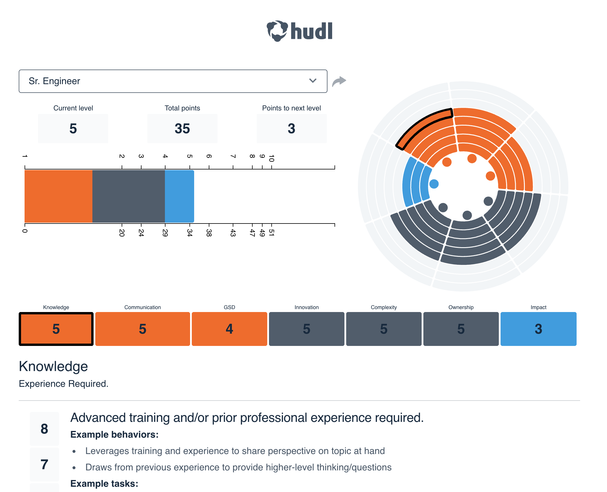

# Hudl Levels

Levels is Hudl's tool for sharing information related to the expectations of every role in the company, and how those expectations map to compensation levels. People Ops grades each role against a rubric, allowing for roles in departments across the company to be recognized equally. It's hosted at [levels.hudltools.com](http://levels.hudltools.com)

Levels is an extension of Snowflake. Snowflake is Medium's tool for planning and supporting our engineers' career development. You can read more
about how we use this tool in our [growth framework documentation](https://medium.com/s/engineering-growth-framework).
Our growth tool is hosted [publicly](https://snowflake.medium.com).

## Updating Role Data

To change roles, titles, or scoring information, update the Google spreadsheet [here](https://docs.google.com/spreadsheets/d/1mbJKER-z0wxtRn_2VQ2rsYmWyGFVsLyd4rte0ZtVgiI/edit?usp=sharing).

Then run the following:

`yarn parse`

Which parses the Google spreadsheet into a CSV referenced within the app. To push those updates to the site, follow the instructions for [Building](#Building) and [Deployment](#Deployment) below.

## Installation

Get yarn if you don’t have it already:

`npm install -g yarn`

Install dependencies:

`yarn`

### Running the dev server

`yarn dev`

### Building

`yarn export`

This will put a static version of the site in `out/`.

### Deployment

Levels is hosted statically on S3. To deploy a new version, simply upload the contents of `out/` into the bucket `levels.hudltools.com`. Make the contents publicly readable (this bucket is inside our internal VPC, so you can only access it on network).
